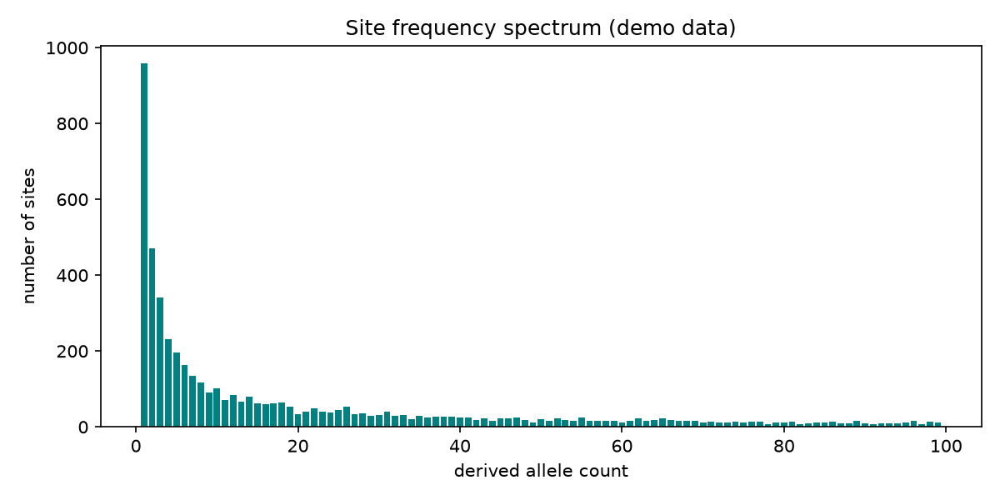

# Site Frequency Spectrum

The distribution of how common each variant is in a population carries the signature of its entire history — growth, bottlenecks, selection. That distribution is the site frequency spectrum.

## Why This Matters

Most population-genetic tests — Tajima's D, demographic inference, selection scans — are functions of the site frequency spectrum. A neutral, constant-size population produces a characteristic 1/frequency shape; departures from it are how you detect expansion, contraction, or selection. Seeing the raw spectrum first keeps those tests interpretable.

## How It Works

1. Count the derived allele at every polymorphic site.
2. Tally how many sites have each allele count.
3. Plot counts against frequency.

## What the Demo Shows



The demo draws a neutral spectrum, where rare variants massively outnumber common ones (the 1/frequency shape). That baseline is what real data is compared against to spot demographic or selective signals.

## Run It

```bash
pip install -r requirements.txt
python demo.py
```

> Demonstrated on synthetic data, so it's fully reproducible with no external downloads.
